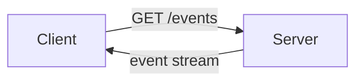

# Presentation Builder

## Overview

OpenSpace presentations use reveal.js rendered in the IDE via `.deck.md` files stored in `design/deck/`. The format is Markdown with YAML frontmatter. This skill teaches you to craft presentations that are visually clear, technically precise, and optimized for explaining complex ideas to a developer during a vibe-coding session.

## Critical: Required Format

ALL presentations MUST have:
1. YAML frontmatter with `title:` field
2. Slide separators `---` between EVERY horizontal slide
3. `===` for vertical (nested) slides

**CRITICAL: The first slide's content goes AFTER the first `---`. Content before the first `---` is frontmatter or CSS, NOT a slide.**

Without these, the presentation renders BLANK or starts from slide 2.

Minimal working example:

```markdown
---
title: My Presentation
theme: openspace-modern
---

# First Slide — THIS IS SLIDE 1

Content here (this is the actual first slide)

---

# Second Slide — THIS IS SLIDE 2

More content
```

Key requirements:
- First `---` closes frontmatter — everything before it is metadata, NOT a slide
- First slide content MUST come AFTER the first `---`
- Use `---` to separate horizontal slides (left/right navigation)
- Use `===` to separate vertical slides (up/down, nested under previous)
- Every slide MUST be separated by `---` or `===`
- Plain markdown with headers only = BLANK presentation

### Common Mistake: Empty First Slide

**WRONG** — CSS becomes slide 1 (appears blank):
```markdown
---
title: My Deck
---

<style>
/* This CSS becomes SLIDE 1 and appears blank! */
.reveal { color: red; }
</style>

---

# First Slide  ← This is actually SLIDE 2!
```

**RIGHT** — Put CSS at the END of the file, after all slides:
```markdown
---
title: My Deck
---

# First Slide  ← This IS slide 1

Content here

---

# Second Slide

More content

---

<!-- Put all CSS at the very end -->
<style>
.reveal { color: red; }
</style>
```

**Why this happens:** In reveal.js, everything between the frontmatter's closing `---` and the first slide separator `---` becomes slide 1. CSS blocks don't render visible content, so slide 1 appears blank.

## File Location

Store all presentations at `design/deck/my-name.deck.md`

## Choose Your Template

Pick the template that matches your intent — copy it from `.opencode/skills/presentation-builder/templates/`:

| Template | When to use |
|----------|-------------|
| `architecture-comparison.deck.md` | Comparing two architectural approaches (monolith vs micro, REST vs GraphQL, SQL vs NoSQL) |
| `code-tutorial.deck.md` | Walking through code step by step, teaching a pattern or API |
| `concept-explanation.deck.md` | Explaining how something works (how React reconciliation works, what a JWT is) |
| `options-comparison.deck.md` | Presenting N options with criteria and a recommendation |
| `problem-solution.deck.md` | Problem narrative → diagnosis → solution (bug post-mortems, tech debt, refactor proposals) |

**Demo visuals requirement (all templates):** Include at least **1 diagram** and **1 image** in every demo deck.

## Design Principles

### The One-Idea-Per-Slide Rule

Each slide answers exactly one question. If you can ask "but what about X?" after reading a slide, that's a second slide.

Bad: A slide titled "Microservices" that covers definition, benefits, drawbacks, and when to use all at once.
Good: Four slides — one per concept, built up sequentially.

### Text Density: The 3×5 Golden Standard

Avoid text-heavy slides. The **3×5 Rule** is a golden standard to aim for: roughly 3 bullet points per slide, roughly 5 words per bullet.

**This is a guideline, not a hard rule.** Sometimes you need 5 bullets. Sometimes you need longer explanations. Use judgment:
- **Summary moments**: Stick close to 3×5 for crystallizing takeaways
- **Detail slides**: Expand when the complexity requires it
- **Code slides**: Focus on the code, minimize bullet text

**Bullet point formatting:**
- Keep bullet points on single lines when possible (avoid word wrapping)
- If a bullet wraps to a second line, consider:
  - Shortening the text
  - Splitting into two bullets
  - Moving details to speaker notes
- Use consistent punctuation (all fragments end with period, or all without)

**Pattern for complex topics:**
1. **Detail slide** — full explanation with all context needed
2. **Summary slide** — 3 bullets, 3-5 words each, capturing the essence

This alternation lets the audience absorb details, then crystallize the takeaway.

```markdown
---

## SSE: Server-Sent Events

Server-Sent Events provide a unidirectional stream from server to client over a single HTTP connection that remains open. The browser receives text events as they occur without polling.

- Uses standard HTTP, works through most firewalls
- Automatic reconnection with Last-Event-ID header
- Text-only format, built-in event types

---

## SSE in 3 Words

- **One-way** — server to client only
- **Persistent** — single HTTP connection
- **Simple** — text events over HTTP
```

### Progressive Disclosure (Use Sparingly)

**Use progressive disclosure cautiously.** It's a nice effect for specific moments, but don't make it the default. Most slides should show their full content immediately.

**When to use fragments:**
- Building suspense toward an "aha" moment or conclusion
- Walking through a sequence where each step depends on understanding the previous
- Highlighting one item among peers for comparison

**When NOT to use fragments:**
- Default slide content — most slides should be fully visible
- Simple bullet lists where items are independent
- When it would frustrate the viewer to wait for content

**Visual placeholder pattern** — for the rare cases when you want to show "there's more coming":

```markdown
---

## How It Works

<div style="border: 2px dashed #6366f1; border-radius: 8px; padding: 1em; margin: 0.5em 0;">
  <p style="color: #818cf8; margin: 0;">Step 1: Client establishes connection...</p>
</div>

<div class="fragment" style="border: 2px solid #10b981; border-radius: 8px; padding: 1em; margin: 0.5em 0; background: rgba(16, 185, 129, 0.1);">
  <p style="color: #34d399; margin: 0; font-weight: bold;">Step 1: Client establishes connection</p>
  <p style="margin: 0.5em 0 0; font-size: 0.9em;">GET /events with Accept: text/event-stream</p>
</div>

<div style="border: 2px dashed #6366f1; border-radius: 8px; padding: 1em; margin: 0.5em 0;">
  <p style="color: #818cf8; margin: 0;">Step 2: Server streams events...</p>
</div>

<div class="fragment" style="border: 2px solid #10b981; border-radius: 8px; padding: 1em; margin: 0.5em 0; background: rgba(16, 185, 129, 0.1);">
  <p style="color: #34d399; margin: 0; font-weight: bold;">Step 2: Server streams events</p>
  <p style="margin: 0.5em 0 0; font-size: 0.9em;">data: {"message": "Hello"}\n\n</p>
</div>
```

Use **separate slides** when each point needs its own visual treatment or when the transition itself conveys meaning.

### Visual-First Design

**Every presentation must include visuals.** Text-only slides are ineffective for conveying complex technical concepts.

#### Visuals Playbook

**Decision tree:**
- **Diagram first** when explaining structure, flow, or architecture.
- **Image/illustration** when a metaphor or emotion clarifies the idea.
- **Atmosphere image** only for title or section divider slides.

**Minimums:**
- All decks: at least 2 visuals.
- Demo decks: 3-5 visuals, including **1 diagram** and **1 image**.

**Local asset workflow (required):**
1. Search and download a candidate.
2. Store under `design/assets/`.
3. Reference the local path in the deck.
4. Add attribution in speaker notes when required.

**Local asset paths:**
- `design/assets/images/...`
- `design/assets/diagrams/...`
- `design/assets/icons/...`

**Note:** If an image source requires attribution, add a `Note:` in the slide where it appears.

#### Local Visual Examples

**Full background image (local):**
```markdown
---

<!-- .slide: data-background-image="design/assets/images/terminal-infra-hero.jpg" data-background-opacity="0.3" -->

# Terminal Lab
```

**Split layout with diagram image:**
```markdown
---

<div style="display: flex; gap: 2em; align-items: center;">
  <div style="flex: 1;">
    <h2>Request Flow</h2>
    <p>Client request passes through limiter gate.</p>
  </div>
  <div style="flex: 1;">
    
  </div>
</div>
```

**HTML/CSS axis chart (local theme colors):**
```markdown
---

## Latency vs Overhead

<div style="position: relative; height: 320px; margin: 1em 0; border-left: 2px solid var(--axis); border-bottom: 2px solid var(--axis);">
  <div style="position: absolute; left: -40px; top: 50%; transform: rotate(-90deg); font-size: 0.7em; color: var(--axis-label);">Overhead →</div>
  <div style="position: absolute; bottom: -28px; left: 50%; transform: translateX(-50%); font-size: 0.7em; color: var(--axis-label);">Latency →</div>
  <div style="position: absolute; left: 20%; bottom: 20%; text-align: center;">
    <div style="width: 14px; height: 14px; background: var(--chart-1); border-radius: 50%; margin: 0 auto;"></div>
    <p style="font-size: 0.65em; margin: 0.3em 0;">Polling</p>
  </div>
  <div style="position: absolute; left: 60%; bottom: 40%; text-align: center;">
    <div style="width: 14px; height: 14px; background: var(--chart-2); border-radius: 50%; margin: 0 auto;"></div>
    <p style="font-size: 0.65em; margin: 0.3em 0;">SSE</p>
  </div>
</div>
```

#### Creating Diagrams

You have several tools for creating diagrams:

**1. TLDraw (OpenSpace Whiteboard)**
Create diagrams in the local TLDraw whiteboard, then export as images:
- Open the whiteboard: `whiteboard.open` tool or use the whiteboard pane
- Draw architecture diagrams, flowcharts, or comparisons
- Export as PNG/SVG
- Store exports under `design/assets/diagrams/`
- Reference the local asset path in the deck

**2. Mermaid Diagrams**
RevealJS supports Mermaid for text-based diagrams:

```markdown

```

Common Mermaid diagram types:
- `graph TD/LR` — flowcharts and architecture diagrams
- `sequenceDiagram` — sequence diagrams for request/response flows
- `gantt` — timelines and project schedules

**3. HTML/CSS Diagrams**
For simple diagrams, use inline HTML with flexbox/grid layouts (see examples below).

#### Finding Images Online

Search for high-quality images to use as backgrounds or illustrations:

**Recommended sources:**
- **Unsplash** (`images.unsplash.com`) — free, high-quality photos
- **Pexels** — free stock photos
- **Flaticon** — icons and vector graphics

**Search patterns:**
- Concept metaphors: "network cables", "data flow", "communication"
- Abstract: "gradient", "technology", "abstract background"
- Icons: Use emoji or search for specific icon packs

**Image Storage & Organization:**

To keep the workspace tidy, store images in a consistent location:

```
design/
  deck/
    my-presentation.deck.md
  assets/
    images/           # Downloaded background images
      server-room.jpg
      network-cables.jpg
    diagrams/         # Exported from TLDraw/whiteboard
      architecture.png
      flowchart.svg
```

**Reference local images:**
```markdown
<!-- .slide: data-background-image="design/assets/images/server-room.jpg" data-background-opacity="0.3" -->
```

**Remote images:** Only acceptable for quick prototyping. Production decks must use local assets stored in `design/assets/`.

#### Background Image Patterns

**Pattern 1: Full background with opacity (for title slides)**
```markdown
<!-- .slide: data-background-image="design/assets/images/tech-background.jpg" data-background-opacity="0.25" -->

<div class="centered">
  <h1>Title</h1>
  <p>Subtitle</p>
</div>
```

**Pattern 2: Carved-out content box (for mixed image + text)**
```markdown
<!-- .slide: data-background-image="design/assets/images/concept-image.jpg" -->

<div style="background: rgba(15, 23, 42, 0.85); padding: 2em; border-radius: 12px; max-width: 70%;">
  <h2>Content Title</h2>
  <p>Your text here is readable over the image...</p>
</div>
```

**Pattern 3: Image on one side (for split layouts)**
```markdown
<div style="display: flex; gap: 2em;">
  <div style="flex: 1;">
    <h2>Title</h2>
    <p>Content here...</p>
  </div>
  <div style="flex: 1;">
    
  </div>
</div>
```

**⚠️ WARNING: Never use busy background images on text-heavy slides.** Use atmosphere images only for:
- Title slides
- Section dividers
- Slides with minimal text (1-2 lines max)

#### Types of Visuals

**1. Atmosphere Images (Metaphors)**
Before each major concept, use a slide with a large background image that evokes the theme:

```markdown
---

<!-- .slide: data-background-image="https://images.unsplash.com/photo-1451187580459-43490279c0fa" data-background-opacity="0.4" -->

# Communication Patterns

<div style="text-align: center; padding-top: 4em;">
  <p style="font-size: 1.5em; color: #f8fafc;">How systems talk to each other</p>
</div>
```

Image themes for common concepts:
- **Communication** — satellite dishes, network cables, mail delivery
- **Speed/Efficiency** — race cars, flowing water, light trails
- **Security** — locks, shields, vault doors
- **Architecture** — building blueprints, foundations, bridges
- **Data Flow** — rivers, highways, conveyor belts

**2. Diagrams for Comparisons**
When comparing approaches (HTTP polling vs SSE vs WebSockets), use a visual diagram:

```markdown
---

## Real-Time Options Compared

<div style="display: flex; justify-content: space-around; align-items: flex-start; margin-top: 1em;">
  <div style="text-align: center; padding: 1em;">
    <div style="font-size: 3em;">🔄</div>
    <h3 style="margin: 0.3em 0;">HTTP Polling</h3>
    <p style="font-size: 0.7em; color: #94a3b8;">Repeated requests</p>
    <div style="margin-top: 0.5em; font-size: 0.65em;">
      <span style="color: #ef4444;">High overhead</span><br>
      <span style="color: #f59e0b;">~1s latency</span>
    </div>
  </div>
  
  <div style="text-align: center; padding: 1em; border: 2px solid #6366f1; border-radius: 12px; background: rgba(99, 102, 241, 0.1);">
    <div style="font-size: 3em;">➡️</div>
    <h3 style="margin: 0.3em 0; color: #818cf8;">SSE</h3>
    <p style="font-size: 0.7em; color: #94a3b8;">Server push</p>
    <div style="margin-top: 0.5em; font-size: 0.65em;">
      <span style="color: #10b981;">Low overhead</span><br>
      <span style="color: #10b981;">~real-time</span>
    </div>
  </div>
  
  <div style="text-align: center; padding: 1em;">
    <div style="font-size: 3em;">🔄</div>
    <h3 style="margin: 0.3em 0;">WebSockets</h3>
    <p style="font-size: 0.7em; color: #94a3b8;">Bidirectional</p>
    <div style="margin-top: 0.5em; font-size: 0.65em;">
      <span style="color: #10b981;">Low overhead</span><br>
      <span style="color: #10b981;">True real-time</span>
    </div>
  </div>
</div>
```

**3. Visual Comparisons (2D/3D Axes)**
Plot options on axes to show trade-offs:

```markdown
---

## The Latency vs Complexity Trade-off

<div style="position: relative; height: 400px; margin: 1em 0; border-left: 2px solid #64748b; border-bottom: 2px solid #64748b;">
  <!-- Y-axis label -->
  <div style="position: absolute; left: -40px; top: 50%; transform: rotate(-90deg); font-size: 0.7em; color: #94a3b8;">Complexity →</div>
  
  <!-- X-axis label -->
  <div style="position: absolute; bottom: -30px; left: 50%; transform: translateX(-50%); font-size: 0.7em; color: #94a3b8;">Latency →</div>
  
  <!-- HTTP Polling -->
  <div style="position: absolute; left: 15%; bottom: 15%; text-align: center;">
    <div style="width: 16px; height: 16px; background: #ef4444; border-radius: 50%; margin: 0 auto;"></div>
    <p style="font-size: 0.65em; margin: 0.3em 0;">HTTP Polling</p>
  </div>
  
  <!-- SSE -->
  <div style="position: absolute; left: 60%; bottom: 40%; text-align: center;">
    <div style="width: 16px; height: 16px; background: #10b981; border-radius: 50%; margin: 0 auto;"></div>
    <p style="font-size: 0.65em; margin: 0.3em 0;">SSE</p>
  </div>
  
  <!-- WebSockets -->
  <div style="position: absolute; left: 85%; bottom: 75%; text-align: center;">
    <div style="width: 16px; height: 16px; background: #f59e0b; border-radius: 50%; margin: 0 auto;"></div>
    <p style="font-size: 0.65em; margin: 0.3em 0;">WebSockets</p>
  </div>
</div>
```

**4. Architecture Diagrams**
Show data flow with arrows and labeled components:

```markdown
---

## SSE Architecture

<div style="display: flex; align-items: center; justify-content: center; gap: 2em; margin-top: 2em;">
  <!-- Client -->
  <div style="text-align: center;">
    <div style="width: 100px; height: 80px; border: 2px solid #3b82f6; border-radius: 8px; display: flex; align-items: center; justify-content: center; background: rgba(59, 130, 246, 0.1);">
      <span style="font-size: 2em;">🖥️</span>
    </div>
    <p style="margin-top: 0.5em; font-size: 0.75em;">Browser</p>
  </div>
  
  <!-- Arrow -->
  <div style="display: flex; flex-direction: column; align-items: center;">
    <div style="font-size: 1.5em; color: #64748b;">←</div>
    <p style="font-size: 0.6em; color: #94a3b8; margin: 0;">Event stream</p>
  </div>
  
  <!-- Server -->
  <div style="text-align: center;">
    <div style="width: 100px; height: 80px; border: 2px solid #10b981; border-radius: 8px; display: flex; align-items: center; justify-content: center; background: rgba(16, 185, 129, 0.1);">
      <span style="font-size: 2em;">⚙️</span>
    </div>
    <p style="margin-top: 0.5em; font-size: 0.75em;">Server</p>
  </div>
</div>

<div style="margin-top: 2em; text-align: center; font-size: 0.75em; color: #94a3b8;">
  Single HTTP connection • Text events • Automatic reconnect
</div>
```

### Code on Slides: Show, Don't Tell

Show the minimum code needed to make the point. Use line highlighting to direct attention. Use auto-animate between slides to show code evolution.

#### Syntax Highlighting

**Always use syntax highlighting for code blocks.** Specify the language for proper color highlighting:

```markdown
```javascript
const source = new EventSource('/events');
source.addEventListener('message', (e) => {
  console.log(e.data);
});
```
```

**Supported languages:**
- `javascript`, `typescript`, `python`, `java`, `go`, `rust`
- `html`, `css`, `json`, `yaml`, `bash`
- `jsx`, `tsx`, `sql`, `graphql`

**Code highlighting colors** (from the CSS in templates):
- Keywords/functions: `#93c5fd` (light blue)
- Strings: `#6ee7b7` (green)
- Comments: `#64748b` (gray)
- Variables: `#e2e8f0` (off-white)

**Line highlighting for step-by-step reveals:**
```markdown
```javascript [1-3|5-8|10-12]
// Lines 1-3 highlighted first
// Then lines 5-8
// Finally lines 10-12
```
```

Rules:
- If the code block is more than 15 lines, it's probably two slides
- Always use `[data-line-numbers]` with step highlights for tutorial-style code walks

### Comparison Slides: Structure for Decision

When comparing options, use a consistent structure:
1. Present each option's "hero" slide first (what is it at its best)
2. Then the head-to-head comparison
3. Then the decision criteria
4. Finally the recommendation

Never start with the recommendation. The audience needs to build understanding first.

### Title Slide: Signal the Narrative

The title slide sets expectations. Use a subtitle that tells the user what they'll be able to decide or do after watching.

Example: "After this: you'll know when to choose Postgres over MongoDB for your use case."

### Closing Slide: Action, Not Summary

Don't summarize. The last slide should answer "so what do I do now?" — give the user a clear next action or decision point.

## Themes

For technical presentations in vibe coding sessions:
- `openspace-modern` — Default dark theme, great for code-heavy content
- `openspace-ocean` — Blue tones, good for architecture diagrams
- `openspace-sunset` — Warm tones, approachable
- `openspace-forest` — Green tones, calm

Built-in RevealJS themes:
- `night` — Dark with orange accents, high contrast
- `moon` — Dark blue, softer on eyes for long explanations
- `white` — Clean, professional
- `solarized` — Easy on eyes for code

## Key RevealJS Features for Technical Presentations

### Code with Step-by-Step Highlights

```markdown
```typescript [1-3|5-8|10-12]
// Step 1: imports highlighted
// Step 2: setup highlighted
// Step 3: usage highlighted
` ``
```

Each `|` separated range is a step — click advances to next highlight group.

### Auto-Animate for Code Evolution

Show code growing or changing between slides — RevealJS smoothly animates matching elements:

```markdown
<!-- .slide: data-auto-animate -->
<pre data-id="code-block"><code data-trim data-line-numbers>
const handler = async (req) => {
  return { status: 200 }
}
</code></pre>

---

<!-- .slide: data-auto-animate -->
<pre data-id="code-block"><code data-trim data-line-numbers>
const handler = async (req) => {
  const user = await auth(req)
  if (!user) return { status: 401 }
  return { status: 200 }
}
</code></pre>
```

The `data-id` attribute on both `<pre>` elements tells RevealJS to animate between them. The value must match between slides.

### r-stack for Layered Reveals

Show one thing at a time in the same visual space:

```markdown
<div class="r-stack">
  <div class="fragment fade-out" data-fragment-index="0">State 1</div>
  <div class="fragment current-visible" data-fragment-index="0">State 2</div>
  <div class="fragment">Final state</div>
</div>
```

### Two-Column Layout for Comparisons

```markdown
<div style="display: flex; gap: 2em; text-align: left;">
  <div style="flex: 1;">

  **Option A**
  - Pro 1
  - Pro 2

  </div>
  <div style="flex: 1;">

  **Option B**
  - Pro 1
  - Pro 2

  </div>
</div>
```

### Fragment Types

```markdown
<!-- .element: class="fragment" -->            fade in (default)
<!-- .element: class="fragment fade-up" -->    slide up while fading in
<!-- .element: class="fragment fade-out" -->   fade out on advance
<!-- .element: class="fragment highlight-red" -->   highlight red
<!-- .element: class="fragment highlight-green" --> highlight green
<!-- .element: class="fragment current-visible" --> visible only for one step
```

### Slide Backgrounds

```markdown
<!-- .slide: data-background-color="#1a1a2e" -->
<!-- .slide: data-background-gradient="linear-gradient(135deg, #0f2027 0%, #2c5364 100%)" -->
<!-- .slide: data-background-image="path/to/image.jpg" data-background-opacity="0.3" -->
```

### Slide Attributes

```markdown
<!-- .slide: data-auto-animate -->
<!-- .slide: data-transition="zoom" -->
<!-- .slide: data-visibility="hidden" -->    skip this slide in presentation
<!-- .slide: data-timing="60" -->            60 seconds for auto-advance
```

### Speaker Notes

```markdown
Note: This note is only visible in speaker view (press S).
```

## MCP Tools for Presentations

```typescript
// List all presentation files
await mcp.call('presentation.list', {})

// Open in the OpenSpace UI
await mcp.call('presentation.open', { name: 'my-deck.deck.md' })

// Read current content
await mcp.call('presentation.read', { name: 'my-deck.deck.md' })

// Update content (full replace)
await mcp.call('presentation.update', { name: 'my-deck.deck.md', content: newContent })

// Navigate to a specific slide
await mcp.call('presentation.navigate', { slideIndex: 2 })
```

## Validation

Run before presenting:

```bash
node scripts/validate-presentation.js design/deck/my-deck.deck.md
```

## Full RevealJS Syntax Reference

For complete syntax details: `.opencode/skills/presentation-builder/revealjs-reference.md`
