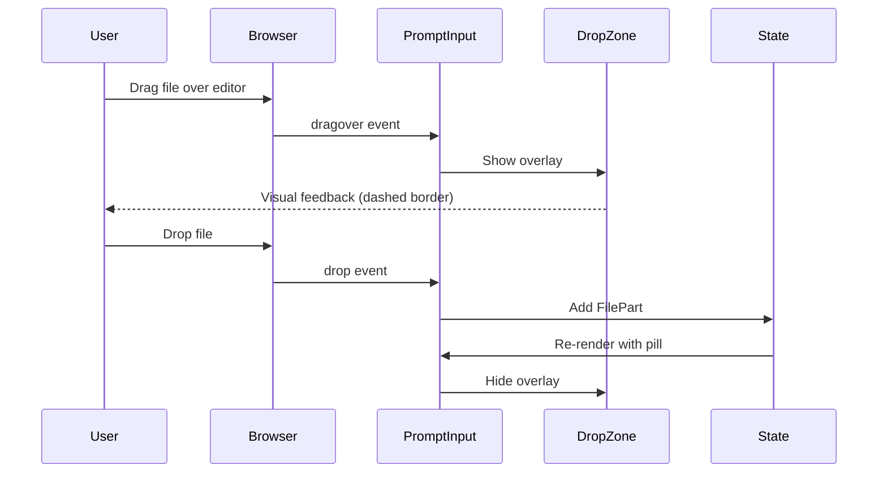

# Requirements: Multi-part Prompt Input

## 1. Introduction

### 1.1 Background

Phase 1 of Theia Openspace established the core connection to the opencode server with a basic chat widget that supports text-only messages. Task 2.1 upgrades the prompt input to support **multi-part messages** — a critical feature from the reference opencode client that enables:

- **File attachments** — reference files with optional line selections (e.g., `src/auth.ts:15-30`)
- **Image attachments** — paste or drag-drop images (PNG, JPEG, GIF, WebP, PDF)
- **@agent mentions** — route messages to specific agents with typeahead autocomplete
- **Mixed composition** — combine text, files, images, and @mentions in a single message

The current simple `<textarea>` input in `extensions/openspace-chat/src/browser/chat-widget.tsx` (lines 424-432) will be replaced with a rich content-editable interface ported from the opencode client's `packages/app/src/components/prompt-input/` implementation.

### 1.2 Scope

**In Scope:**
- Multi-part message composition UI (contenteditable-based editor)
- File attachment via button and drag-drop (workspace files only)
- Image attachment via paste, drag-drop, and file picker (PNG, JPEG, GIF, WebP, PDF)
- @agent mention typeahead (using Theia's `QuickInputService` or custom implementation)
- @file mention typeahead (workspace file search)
- Attachment preview before sending (images show thumbnails, files show name)
- Remove attachment functionality
- Message part serialization matching opencode server API format
- Keyboard navigation (Tab for typeahead selection, Enter to send, Shift+Enter for newline)
- Drag-drop overlay with visual feedback

**Out of Scope (Deferred to Later Phases):**
- Comment annotations on file references (Phase 2 or later)
- Shell mode (`!` prefix) — requires terminal integration (Phase 4)
- Slash commands (`/`) — requires command integration (Phase 2.8)
- History navigation (up/down arrows) — nice-to-have, not blocking
- Custom agents list (depends on agent discovery — Phase TBD)
- Voice/audio attachments — future capability
- Collaborative editing indicators — future capability

### 1.3 Goals

1. **Feature parity** with opencode client's prompt input (core features)
2. **Theia-native** implementation using Theia's DI services and patterns
3. **Accessibility** — keyboard-navigable, ARIA-annotated, screen-reader friendly
4. **Performance** — file encoding and preview generation must not block UI
5. **Error resilience** — graceful handling of file read failures, large files, network issues

### 1.4 Success Criteria

- User can compose a message with text + file + image + @mention in one go
- Parts are correctly serialized and sent to opencode server via `SessionService.sendMessage()`
- Opencode server receives parts in expected format (verified via server logs or response)
- All interactions are keyboard-accessible (no mouse required)
- Build passes with zero errors, unit tests cover core logic, integration test verifies round-trip

---

## 2. User Stories

### US-1: File Attachment via Button
**As a** developer  
**I want to** click a button to attach a file from my workspace  
**So that** the AI can reference specific code when answering my question  

**Acceptance:**
- File picker opens showing workspace files
- Selected file appears as a pill/badge in the input area
- Clicking the pill opens the file (optional preview)
- File path and selection range (if any) are sent to opencode server

### US-2: File Attachment via Drag-Drop
**As a** developer  
**I want to** drag a file from the file tree into the prompt input  
**So that** I can quickly reference files without navigating menus  

**Acceptance:**
- Dragging a file over the input shows a visual drop zone
- Dropping the file adds it as an attachment
- File appears as a pill with filename
- Drag source can be Theia's file tree or external file manager (desktop app only)

### US-3: Image Attachment via Paste
**As a** developer  
**I want to** paste an image from my clipboard  
**So that** I can share screenshots or diagrams with the AI  

**Acceptance:**
- Copying an image to clipboard, then pasting into input → image appears as thumbnail
- Clicking thumbnail opens preview modal
- Supported formats: PNG, JPEG, GIF, WebP, PDF (images extracted)
- Image data URL sent to opencode server as file part with `mime` and `url`

### US-4: Image Attachment via Drag-Drop
**As a** developer  
**I want to** drag an image file from my desktop into the prompt input  
**So that** I can attach reference images without copy/paste  

**Acceptance:**
- Dragging image file over input shows drop zone with "Drop image here" message
- Dropping adds image as thumbnail
- Same preview and remove behavior as pasted images

### US-5: @Agent Mention with Typeahead
**As a** developer  
**I want to** type `@` to see a list of available agents  
**So that** I can route my message to a specific agent (e.g., @oracle for architecture questions)  

**Acceptance:**
- Typing `@` opens a dropdown with agent names
- Arrow keys navigate, Enter/Tab selects
- Selected agent appears as a colored pill (distinct from files)
- Agent name sent as `AgentPartInput` to opencode server

### US-6: @File Mention with Typeahead
**As a** developer  
**I want to** type `@` followed by a filename to search workspace files  
**So that** I can reference files without leaving the keyboard  

**Acceptance:**
- Typing `@src` shows files matching "src" (fuzzy search)
- Recent files appear at top of list
- Selecting a file adds it as a pill with file icon
- File path sent as `FilePartInput` to opencode server

### US-7: Remove Attachment
**As a** developer  
**I want to** click an X button on an attachment pill  
**So that** I can remove mistakenly added files or images before sending  

**Acceptance:**
- Each pill has a small X button (visible on hover or always visible on mobile)
- Clicking X removes the attachment from the message
- Re-adding the same file is allowed

### US-8: Keyboard Navigation
**As a** developer  
**I want to** navigate the entire input interface with keyboard only  
**So that** I can work efficiently without switching to mouse  

**Acceptance:**
- Tab / Shift+Tab moves focus between input, attach button, send button
- Arrow keys navigate typeahead dropdown
- Enter selects from dropdown or sends message (context-dependent)
- Shift+Enter inserts newline in text
- Escape closes dropdown or clears focus

### US-9: Mixed Message Composition
**As a** developer  
**I want to** compose a message like "Please review @src/auth.ts lines 20-35 and @oracle can you suggest improvements? [screenshot.png]"  
**So that** I can provide complete context in one message  

**Acceptance:**
- Text, file mentions, agent mentions, and images can coexist
- Order is preserved (left-to-right, top-to-bottom)
- All parts sent to opencode server in a single `sendMessage()` call
- Parts array maintains correct sequence

---

## 3. Functional Requirements

### FR-1: Content-Editable Input Replacement

**FR-1.1** Replace the current `<textarea>` (lines 424-432 of `chat-widget.tsx`) with a `<div contenteditable="true">` managed by a new `PromptInput` React component.

**FR-1.2** The editor must support:
- Plain text input
- Inline non-editable pill elements for files and agents (using `<span contenteditable="false">`)
- Programmatic cursor positioning (to insert pills at cursor location)
- Paste interception (to handle image paste separately from text paste)

**FR-1.3** The editor must normalize its internal DOM structure to simplify parsing:
- Text nodes contain only text (with optional zero-width space `\u200B` for caret positioning)
- File/agent pills are `<span>` with `data-type="file"` or `data-type="agent"` attributes
- Line breaks are `<br>` elements

**FR-1.4** A `parseFromDOM()` function must traverse the editor's DOM and produce a `Prompt` array (see FR-2).

**Rationale:** The opencode client uses this pattern for reliable multi-part input. A `<textarea>` cannot render inline pills for attachments.

---

### FR-2: Message Part Data Model

**FR-2.1** Define TypeScript types mirroring the opencode client's prompt model:

```typescript
// In openspace-core/src/common/opencode-protocol.ts

export type Prompt = ContentPart[];

export type ContentPart = TextPart | FilePart | AgentPart | ImagePart;

export interface TextPart {
  type: 'text';
  content: string;
  start: number;  // Character offset in concatenated text
  end: number;
}

export interface FilePart {
  type: 'file';
  path: string;          // Workspace-relative or absolute path
  content: string;       // Display text (e.g., "@src/auth.ts")
  start: number;
  end: number;
  selection?: {          // Optional line selection
    startLine: number;
    endLine: number;
  };
}

export interface AgentPart {
  type: 'agent';
  name: string;          // Agent name (e.g., "oracle")
  content: string;       // Display text (e.g., "@oracle")
  start: number;
  end: number;
}

export interface ImagePart {
  type: 'image';
  id: string;            // Unique ID (UUID)
  filename: string;      // Original filename
  mime: string;          // MIME type (e.g., "image/png")
  dataUrl: string;       // Base64-encoded data URL
}
```

**FR-2.2** `start` and `end` offsets track cursor position for history navigation and editing (deferred feature, but structure must support it).

**FR-2.3** Image parts do NOT have `start`/`end` because they are not inline in the text — they are displayed as separate thumbnails above the editor.

---

### FR-3: File Attachment

**FR-3.1** Add an "Attach File" button next to the send button in the prompt input UI.

**FR-3.2** Clicking the button opens a file picker filtered to workspace files. Use Theia's `FileService.resolve()` to list files.

**FR-3.3** Selecting a file:
- Creates a `FilePart` with `path` (workspace-relative if possible)
- Inserts a non-editable pill `<span contenteditable="false" data-type="file" data-path="{path}">@{filename}</span>` at cursor position
- Triggers `handleInput()` to re-parse DOM and update prompt state

**FR-3.4** Drag-drop file attachment:
- Listen for `dragover`, `dragleave`, `drop` events on the editor container
- On `dragover` with files: show a visual drop zone overlay ("Drop file here")
- On `drop`: extract file paths from `dataTransfer.getData('text/plain')` (Theia uses `file:{path}` format)
- Add dropped files as `FilePart` entries

**FR-3.5** File validation:
- Check if file exists in workspace before adding (use `FileService.exists()`)
- Show error toast if file not found or not accessible
- No file size limit for file mentions (the server reads the file content, not the client)

**FR-3.6** File selection (optional enhancement for v1):
- If user drags from an editor with text selected, include line range in `FilePart.selection`
- This requires coordination with editor events — may be deferred to v2

---

### FR-4: Image Attachment

**FR-4.1** Supported formats:
- **Accepted MIME types:** `image/png`, `image/jpeg`, `image/gif`, `image/webp`, `application/pdf` (experimental)
- **Maximum size:** 10 MB per image (configurable)

**FR-4.2** Image paste:
- Listen for `paste` event on editor
- Check `event.clipboardData.items` for files with matching MIME types
- Read file as data URL using `FileReader.readAsDataURL()`
- Create `ImagePart` with UUID, filename (fallback: "image.png"), MIME, data URL
- Add to prompt state (outside the editor DOM — images live in separate state)

**FR-4.3** Image drag-drop:
- Same event handling as file drag-drop
- Differentiate by checking file extension or MIME type
- Read file content as data URL

**FR-4.4** Image file picker:
- Use the same "Attach File" button, but filter by image MIME types
- Use browser's `<input type="file" accept="image/*">` for simplicity

**FR-4.5** Image preview:
- Display attached images as 64x64px thumbnails above the editor
- Show filename below thumbnail
- Clicking thumbnail opens full-size preview modal (can reuse Theia's image preview if available)
- Thumbnails have a small X button to remove

**FR-4.6** Image encoding:
- Store as base64 data URL in `ImagePart.dataUrl`
- When sending, pass data URL directly to opencode server in `FilePartInput` format:
  ```typescript
  {
    type: 'file',
    mime: 'image/png',
    url: 'data:image/png;base64,...',
    filename: 'screenshot.png'
  }
  ```

---

### FR-5: @Agent Mention Typeahead

**FR-5.1** Trigger: Typing `@` followed by any character in the editor.

**FR-5.2** Data source: `SessionService` or `OpenCodeService` must expose available agents.
- Check opencode API: `GET /project/:projectID/agent?directory=...` returns `Agent[]`
- Cache agent list in `SessionService`
- Agents have `name`, `mode`, `hidden` properties

**FR-5.3** Filter:
- Show agents where `hidden === false` and `mode !== 'primary'` (per opencode client pattern)
- Fuzzy match on `agent.name`
- Display agent name with optional description (if available)

**FR-5.4** UI:
- Dropdown appears below cursor (or above if not enough space below)
- Use Theia's `QuickInputService` if it supports inline context, otherwise build custom React dropdown
- Dropdown shows agent names, descriptions, and optional icons
- Keyboard navigation: Arrow keys, Enter/Tab to select, Escape to close

**FR-5.5** Selection:
- On select: insert `<span contenteditable="false" data-type="agent" data-name="{name}">@{name}</span>` at cursor
- Remove the trigger `@` and search text from editor
- Close dropdown
- Update prompt state

**FR-5.6** Theming: Style agent pills distinctly from file pills (e.g., blue for agents, orange for files).

---

### FR-6: @File Mention Typeahead

**FR-6.1** Trigger: Typing `@` followed by characters that could match a filename.

**FR-6.2** Data source: Workspace file search using Theia's `FileService.search()` or custom indexing.
- Prioritize recent files (from `EditorManager.recentFiles` or custom tracking)
- Full workspace search for other matches (fuzzy)

**FR-6.3** Dropdown groups:
- **Agents** (top) — show if any match
- **Recent Files** (middle) — show if any match
- **All Files** (bottom) — show remaining matches

**FR-6.4** Selection:
- On select: insert file pill with `data-type="file"` and `data-path="{path}"`
- Store path as workspace-relative if possible (for portability)

**FR-6.5** Performance: Debounce search queries to avoid flooding the file system on every keystroke.

---

### FR-7: Attachment Preview and Removal

**FR-7.1** Image preview area:
- Appears above the editor when `imageAttachments.length > 0`
- Shows thumbnails in a horizontal flexbox with wrap
- Each thumbnail has filename, MIME type indicator, and X button

**FR-7.2** File mention preview:
- File pills in the editor ARE the preview (inline)
- Clicking a file pill (optional): open file in editor or show tooltip with full path

**FR-7.3** Remove image:
- Clicking X button on thumbnail calls `removeImageAttachment(id)`
- Filters image out of prompt state
- Re-renders preview area

**FR-7.4** Remove file/agent mention:
- Clicking X button on pill (or pressing Backspace with cursor at pill edge) removes pill
- Re-parse DOM to update prompt state

---

### FR-8: Message Part Serialization

**FR-8.1** When user presses Enter (without Shift), call `handleSubmit()` which builds request parts.

**FR-8.2** Convert `Prompt` to `MessagePart[]` for opencode server:

```typescript
function buildRequestParts(prompt: Prompt, sessionDirectory: string): MessagePart[] {
  const parts: MessagePart[] = [];

  // 1. Text part (concatenate all TextPart.content)
  const textParts = prompt.filter(p => p.type === 'text') as TextPart[];
  const text = textParts.map(p => p.content).join('');
  parts.push({ type: 'text', text });

  // 2. File parts
  const fileParts = prompt.filter(p => p.type === 'file') as FilePart[];
  for (const file of fileParts) {
    const absolutePath = resolveAbsolute(sessionDirectory, file.path);
    const url = `file://${encodeFilePath(absolutePath)}${fileQuery(file.selection)}`;
    parts.push({
      type: 'file',
      mime: 'text/plain',
      url,
      filename: getFilename(file.path),
      source: {
        type: 'file',
        path: absolutePath,
        text: { value: file.content, start: file.start, end: file.end }
      }
    });
  }

  // 3. Agent parts
  const agentParts = prompt.filter(p => p.type === 'agent') as AgentPart[];
  for (const agent of agentParts) {
    parts.push({
      type: 'agent',
      name: agent.name,
      source: { value: agent.content, start: agent.start, end: agent.end }
    });
  }

  // 4. Image parts
  const imageParts = prompt.filter(p => p.type === 'image') as ImagePart[];
  for (const image of imageParts) {
    parts.push({
      type: 'file',
      mime: image.mime,
      url: image.dataUrl,
      filename: image.filename
    });
  }

  return parts;
}
```

**FR-8.3** Call `SessionService.sendMessage(parts)` with the built parts.

**FR-8.4** After successful send:
- Clear prompt state to default (empty text)
- Clear image attachments
- Clear editor DOM
- Focus editor for next message

---

### FR-9: Keyboard Navigation

**FR-9.1** Enter key behavior:
- **Dropdown open:** Select active item
- **Dropdown closed, Shift not held:** Submit message
- **Shift+Enter:** Insert newline in text (add `\n` or `<br>`)

**FR-9.2** Escape key behavior:
- **Dropdown open:** Close dropdown
- **Dropdown closed:** No action (or clear focus — TBD)

**FR-9.3** Arrow keys:
- **Dropdown open:** Navigate up/down through items
- **Dropdown closed:** Normal caret movement in editor

**FR-9.4** Tab key:
- **Dropdown open:** Select active item (same as Enter)
- **Dropdown closed:** Focus next element (attach button or send button)

**FR-9.5** Backspace at pill edge:
- If caret is immediately after a pill, Backspace removes the pill

---

### FR-10: Drag-Drop Visual Feedback

**FR-10.1** When user drags a file/image over the editor:
- Show a semi-transparent overlay with dashed border
- Display message: "Drop file here to attach" or "Drop image here"
- Overlay covers the editor area only, not the entire chat widget

**FR-10.2** Drag types:
- **Files detected:** show "Drop file here"
- **Images detected:** show "Drop image here"
- **Generic:** show "Drop to attach"

**FR-10.3** On `dragleave`: hide overlay.

**FR-10.4** On `drop`: hide overlay and process drop.

---

## 4. Non-Functional Requirements

### NFR-1: Performance

**NFR-1.1** File read operations must be asynchronous and non-blocking.
- Use `FileReader.readAsDataURL()` with async handling
- Show progress indicator for files > 1 MB

**NFR-1.2** Debounce typeahead search queries:
- Minimum 150ms delay after last keystroke before triggering search
- Cancel previous search if new keystroke arrives

**NFR-1.3** Image thumbnail generation:
- Use browser's native `` rendering with CSS `max-width: 64px; max-height: 64px`
- No additional compression or processing (to avoid blocking)

### NFR-2: Accessibility

**NFR-2.1** All interactive elements must be keyboard-accessible (Tab navigation).

**NFR-2.2** ARIA annotations:
- Editor has `role="textbox"` and `aria-multiline="true"`
- Dropdown has `role="listbox"` with `aria-activedescendant` pointing to active item
- Attach button has `aria-label="Attach file"`
- Pills have `aria-label` with file/agent name

**NFR-2.3** Screen reader support:
- Pills announce their content ("File: src/auth.ts" or "Agent: oracle")
- Image thumbnails have `alt` text with filename

### NFR-3: Error Handling

**NFR-3.1** File read errors:
- Show toast notification: "Failed to read file: {filename}"
- Log error to console
- Do not add attachment to prompt

**NFR-3.2** Large file warnings:
- If image exceeds 10 MB, show toast: "Image too large (max 10 MB)"
- Do not add attachment

**NFR-3.3** Network errors (agent/file search):
- Show "Search unavailable" message in dropdown
- Allow user to continue typing (search may recover)

**NFR-3.4** Invalid file paths:
- If file mention points to non-existent file, still send (server will handle error)
- Optionally: validate on client and show warning icon on pill

### NFR-4: Browser Compatibility

**NFR-4.1** Must work in Electron (desktop app) and modern browsers (Chrome, Firefox, Safari latest).

**NFR-4.2** Desktop-specific features (clipboard image access) use Electron APIs where available, fall back gracefully in browser.

### NFR-5: Security

**NFR-5.1** File paths must be validated to prevent directory traversal attacks.
- Use Theia's `FileService` URI resolution (handles security internally)
- Do not construct raw `file://` URLs without encoding

**NFR-5.2** Image data URLs must be sanitized to prevent XSS:
- Use React's built-in escaping for `src` attributes
- Do not render user-provided HTML in image previews

---

## 5. Acceptance Criteria

### AC-1: File Attachment via Button
**Given** the chat widget is open  
**When** I click the "Attach File" button and select `src/auth.ts`  
**Then** a pill labeled `@src/auth.ts` appears in the editor  
**And** typing text before/after the pill is possible  

### AC-2: File Attachment via Drag-Drop
**Given** the chat widget is open  
**When** I drag `src/auth.ts` from the file tree into the editor  
**Then** a visual drop zone appears  
**And** dropping the file adds a pill `@src/auth.ts`  

### AC-3: Image Attachment via Paste
**Given** I have an image in my clipboard  
**When** I paste into the editor  
**Then** a thumbnail of the image appears above the editor  
**And** the thumbnail shows the filename (or "image.png")  

### AC-4: Image Attachment via Drag-Drop
**Given** I have an image file on my desktop  
**When** I drag it into the editor  
**Then** a drop zone appears with "Drop image here"  
**And** dropping adds a thumbnail above the editor  

### AC-5: Image Preview and Removal
**Given** an image is attached  
**When** I click the thumbnail  
**Then** a full-size preview modal opens  
**And** clicking the X button on the thumbnail removes it  

### AC-6: @Agent Mention Typeahead
**Given** the chat widget is open  
**When** I type `@or`  
**Then** a dropdown appears with matching agents (e.g., "oracle")  
**And** pressing Enter selects "oracle"  
**And** a blue pill `@oracle` appears in the editor  

### AC-7: @File Mention Typeahead
**Given** the chat widget is open  
**When** I type `@src`  
**Then** a dropdown appears with files matching "src"  
**And** recent files appear at the top  
**And** selecting a file adds an orange pill `@src/auth.ts`  

### AC-8: Mixed Message Composition
**Given** the chat widget is open  
**When** I type "Review ", add `@src/auth.ts`, type " and ", add `@oracle`, then paste an image  
**Then** the editor shows "Review @src/auth.ts and @oracle"  
**And** an image thumbnail appears above  
**And** pressing Enter sends all parts to the server  

### AC-9: Keyboard Navigation - Typeahead
**Given** the typeahead dropdown is open with 3 items  
**When** I press Arrow Down twice  
**Then** the third item is highlighted  
**And** pressing Enter selects it  

### AC-10: Keyboard Navigation - Send
**Given** I have typed text in the editor  
**When** I press Enter  
**Then** the message is sent  
**And** the editor clears  

### AC-11: Keyboard Navigation - Newline
**Given** I have typed text in the editor  
**When** I press Shift+Enter  
**Then** a newline is inserted  
**And** the message is NOT sent  

### AC-12: Message Part Serialization
**Given** I compose a message with:
- Text: "Hello"
- File: `src/auth.ts`
- Agent: `oracle`
- Image: `screenshot.png`  
**When** I send the message  
**Then** the server receives a `MessagePart[]` with:
  1. `{ type: 'text', text: 'Hello' }`
  2. `{ type: 'file', url: 'file://.../src/auth.ts', filename: 'auth.ts' }`
  3. `{ type: 'agent', name: 'oracle' }`
  4. `{ type: 'file', mime: 'image/png', url: 'data:image/png;base64,...', filename: 'screenshot.png' }`  

### AC-13: Error Handling - Large Image
**Given** I try to paste an image larger than 10 MB  
**Then** a toast notification appears: "Image too large (max 10 MB)"  
**And** the image is NOT attached  

### AC-14: Error Handling - File Read Failure
**Given** I try to attach a file that becomes inaccessible (deleted mid-operation)  
**Then** a toast notification appears: "Failed to read file: {filename}"  
**And** the attachment is NOT added  

### AC-15: Drag-Drop Visual Feedback
**Given** I drag a file over the editor  
**Then** a dashed border overlay appears with "Drop file here"  
**And** moving the mouse away hides the overlay  

---

## 6. Out of Scope

The following features are explicitly **NOT** part of Task 2.1 and will be addressed in future tasks:

### OS-1: Comment Annotations
Adding comments to file selections (e.g., "Review this function for security issues") will be implemented in a separate task (likely Phase 2.6 or later). The data model includes `comment` fields, but UI for editing them is deferred.

### OS-2: Shell Mode
The `!` prefix to send messages to a shell instead of the AI agent requires terminal integration (Phase 4) and is not part of the prompt input upgrade.

### OS-3: Slash Commands
The `/` prefix for triggering IDE commands (e.g., `/review`, `/test`) requires command integration (Task 2.8) and is out of scope for Task 2.1.

### OS-4: History Navigation
Using Arrow Up/Down to navigate through previous messages (like a terminal) is a nice-to-have feature but not required for v1. The data model supports it (`start`/`end` offsets), but UI logic is deferred.

### OS-5: Custom Agent Icons
Displaying custom icons for agents (beyond text labels) requires agent metadata and theming — deferred to Phase 5 (theming) or later.

### OS-6: Real-Time Collaboration
Showing other users' cursors or edits in the prompt input is a future feature, not part of the initial implementation.

### OS-7: Voice/Audio Attachments
Supporting audio clips or voice notes requires additional infrastructure (audio recording, playback, transcription) — deferred to a future phase.

### OS-8: PDF Content Extraction
While PDF files can be attached as images, extracting text content from PDFs for analysis is out of scope. The server can read PDF file paths, but inline PDF rendering is not part of Task 2.1.

---

## 7. Implementation Notes

### 7.1 Reference Implementation

The opencode client's multi-part input implementation in `/Users/Shared/dev/opencode/packages/app/src/components/prompt-input/` serves as the reference. Key files to study:

- **`prompt-input.tsx`** (1209 lines) — Main component structure, event handling, state management
- **`build-request-parts.ts`** (180 lines) — Part serialization logic
- **`attachments.ts`** (161 lines) — Image paste and drag-drop handling
- **`editor-dom.ts`** — DOM manipulation helpers (cursor positioning, parsing)
- **`history.ts`** — History navigation (deferred, but shows how `start`/`end` are used)
- **`slash-popover.tsx`** — Dropdown UI (reusable for @mention typeahead)

The Theia implementation should **port the core patterns** (contenteditable, pill insertion, DOM parsing) but **use Theia's services** (DI, FileService, CommandService) instead of the opencode client's SolidJS-specific hooks.

### 7.2 Theia-Specific Adaptations

1. **Dependency Injection:** Inject `FileService`, `EditorManager`, `SessionService` via `@inject` decorators instead of React context.

2. **File Search:** Use Theia's `FileSearchService` or `FileService.resolve()` instead of the opencode client's custom file indexing.

3. **Typeahead UI:** Consider using Theia's `QuickInputService` if it supports inline context menus. If not, build a custom React dropdown similar to `slash-popover.tsx`.

4. **Theming:** Use Theia's CSS variables (`--theia-*`) for colors and spacing. Agent pills use `--theia-blue-500`, file pills use `--theia-orange-500`.

5. **Events:** Use Theia's `Event<T>` and `Emitter<T>` pattern for internal events (e.g., prompt state changes).

### 7.3 Component Structure

Proposed file structure in `extensions/openspace-chat/src/browser/`:

```
openspace-chat/
  src/browser/
    chat-widget.tsx               # Main widget (existing, modified)
    prompt-input/                 # NEW directory
      prompt-input.tsx            # Main input component (replaces textarea)
      prompt-state.ts             # Prompt state management (Prompt type, parse/serialize)
      editor-dom.ts               # DOM helpers (cursor, pill creation, parsing)
      attachments.ts              # Image paste/drop handlers
      typeahead-dropdown.tsx      # @mention dropdown component
      file-preview.tsx            # File pill rendering
      image-preview.tsx           # Image thumbnail rendering
      drag-overlay.tsx            # Drag-drop visual overlay
      build-request-parts.ts      # Serialization logic
```

### 7.4 Integration with ChatWidget

The `ChatWidget` component (`chat-widget.tsx`) currently renders:

```tsx
<textarea
  className="chat-input"
  value={inputValue}
  onChange={e => setInputValue(e.target.value)}
  onKeyDown={handleKeyDown}
  placeholder="Type your message..."
  disabled={isStreaming}
  rows={3}
/>
```

This will be replaced with:

```tsx
<PromptInput
  sessionService={this.sessionService}
  fileService={this.fileService}
  editorManager={this.editorManager}
  onSubmit={handleSend}
  disabled={isStreaming}
/>
```

The `PromptInput` component manages its own state (prompt parts) and calls `onSubmit(parts: MessagePart[])` when Enter is pressed.

### 7.5 Testing Strategy

1. **Unit Tests:** Test `parseFromDOM()`, `buildRequestParts()`, pill insertion, typeahead filtering logic.

2. **Integration Tests:** Test full flow: type text → add file → add image → send → verify parts sent to server.

3. **E2E Tests:** Playwright test that:
   - Opens chat widget
   - Types `@` and selects an agent
   - Attaches a file via button
   - Pastes an image
   - Sends message
   - Verifies server logs show correct parts

4. **Manual Testing:** Verify keyboard navigation, screen reader compatibility, drag-drop from external sources.

---

## 8. Dependencies

### 8.1 Prerequisites
- **Phase 1 complete** (all tasks 1.1–1.15 ✅) — SessionService, OpenCodeService, and message sending infrastructure
- **Task 2.0 complete** (✅) — Session list auto-load fix ensures stable session state

### 8.2 Theia Dependencies
- `@theia/core` — DI, events, widgets
- `@theia/filesystem` — FileService, file search
- `@theia/editor` — EditorManager (for file previews)
- `@theia/monaco` — Monaco editor integration (for syntax highlighting in future renderers)

### 8.3 External Dependencies
- **None** — All functionality uses Theia APIs and browser APIs (FileReader, ClipboardData)

### 8.4 Blocking Tasks
- None. Task 2.1 is independent and can proceed in parallel with other Phase 2 tasks.

### 8.5 Blocked Tasks
- **Task 2.2** (Message timeline) — Can proceed independently, but will integrate with Task 2.1's multi-part output
- **Task 2.3–2.5** (Response renderers) — Independent of Task 2.1
- **Task 2.6** (Session sidebar) — Independent of Task 2.1

---

## 9. Risk Assessment

### Risk 1: Clipboard API Limitations
**Risk:** Browser clipboard API may not support image paste in all environments (especially older Firefox, Safari).  
**Mitigation:** Use feature detection (`ClipboardEvent.clipboardData.items`). Provide fallback: file picker button always works.  
**Severity:** LOW (file picker is fallback)

### Risk 2: Drag-Drop Incompatibility
**Risk:** Theia's drag-drop events may conflict with our custom handlers (file tree drag-drop uses Theia's DnD service).  
**Mitigation:** Use `event.stopPropagation()` and `event.preventDefault()` carefully. Test with Theia's file tree.  
**Severity:** MEDIUM (can block drag-drop feature)

### Risk 3: Typeahead Performance
**Risk:** Searching 10,000+ files in a large workspace may freeze the UI.  
**Mitigation:** Debounce search (150ms), limit results to 50 items, use Theia's indexed search if available.  
**Severity:** MEDIUM (degrades UX but doesn't block core feature)

### Risk 4: ContentEditable Browser Bugs
**Risk:** ContentEditable has known cross-browser inconsistencies (cursor jumping, paste handling, selection).  
**Mitigation:** Use the opencode client's proven normalization strategy (zero-width spaces, BR elements). Extensive testing.  
**Severity:** HIGH (can break input entirely) — mitigated by reference implementation

### Risk 5: Message Part Serialization Mismatch
**Risk:** Opencode server rejects messages if part format is incorrect (schema mismatch).  
**Mitigation:** Follow opencode API spec exactly (reference: `packages/app/src/components/prompt-input/build-request-parts.ts`). Add schema validation tests.  
**Severity:** HIGH (blocks message sending) — mitigated by reference implementation and integration tests

---

## 10. Validation Plan

### 10.1 Unit Tests (Target: 80% coverage)
- `parseFromDOM()` correctly parses text, file pills, agent pills
- `buildRequestParts()` produces correct MessagePart[] for all combinations
- Typeahead filtering matches expected results
- Pill insertion at cursor position works correctly

### 10.2 Integration Tests
- Full round-trip: compose multi-part message → send → server receives correct parts
- Verified via server logs or mock server

### 10.3 E2E Tests (Playwright)
- Test AC-1 through AC-15 (all acceptance criteria)
- Special focus on keyboard navigation and accessibility

### 10.4 Manual Testing Checklist
- [ ] File attachment via button works
- [ ] File attachment via drag-drop works
- [ ] Image paste works (PNG, JPEG, GIF, WebP)
- [ ] Image drag-drop works
- [ ] Image preview modal opens and closes
- [ ] Image removal works
- [ ] @agent typeahead works
- [ ] @file typeahead works
- [ ] Mixed message composition works
- [ ] Keyboard navigation (Tab, Enter, Shift+Enter, Escape, Arrows) works
- [ ] Drag-drop overlay appears and hides correctly
- [ ] Large image rejected with error toast
- [ ] File read error shows error toast
- [ ] Screen reader announces pills correctly (test with NVDA/VoiceOver)

### 10.5 Performance Testing
- [ ] File search completes within 500ms for workspace with 5,000 files
- [ ] Image preview renders within 200ms for 5 MB image
- [ ] No UI freezing during file read operations

---

## 11. Success Metrics

### Objective Metrics
1. **Build Success:** `yarn build` exits 0 with no errors or warnings
2. **Test Coverage:** 80%+ line coverage for `prompt-input/` directory
3. **Test Pass Rate:** 100% of unit tests, integration tests, and E2E tests pass
4. **Accessibility:** All interactive elements are keyboard-accessible (verified by manual testing)

### Subjective Metrics (User Feedback)
1. **Ease of Use:** Users can compose multi-part messages without reading documentation
2. **Performance:** Input feels responsive (no lag or freezing)
3. **Visual Clarity:** File and agent pills are visually distinct and easy to identify

### Acceptance Gate
**Task 2.1 is considered COMPLETE when:**
- All 15 acceptance criteria (AC-1 through AC-15) pass
- Unit tests achieve 80%+ coverage and 100% pass rate
- Integration test confirms server receives correct multi-part message format
- Manual testing confirms keyboard accessibility and screen reader support
- Build passes with zero errors
- Code review approved by CodeReviewer agent (85%+ confidence)

---

## 12. References

### 12.1 OpenCode API Specification
- **Location:** `/Users/Shared/dev/opencode/specs/project.md`
- **Key endpoints:**
  - `POST /project/:projectID/session/:sessionID/message` — Accepts `{ info: Message, parts: Part[] }`
  - `GET /project/:projectID/agent` — Returns agent list

### 12.2 OpenCode Reference Implementation
- **Location:** `/Users/Shared/dev/opencode/packages/app/src/components/prompt-input/`
- **Key files:**
  - `prompt-input.tsx` — Main component
  - `build-request-parts.ts` — Serialization logic
  - `attachments.ts` — Image handling
  - `editor-dom.ts` — DOM helpers

### 12.3 Architecture Specification
- **Location:** `docs/architecture/TECHSPEC-THEIA-OPENSPACE.md`
- **Relevant sections:**
  - §3.1 (OpenCode Server Integration)
  - §3.2 (Session Management)
  - §4 (Chat & Conversation System)

### 12.4 Work Plan
- **Location:** `docs/architecture/WORKPLAN.md`
- **Task definition:** Phase 2, Task 2.1 (lines 394–400)

### 12.5 Related Requirements
- **REQ-SESSION-LIST-AUTOLOAD** — Task 2.0 (prerequisite)
- **REQ-MODEL-DISPLAY** — Task 1.15 (prerequisite)

---

## 13. Glossary

| Term | Definition |
|---|---|
| **Prompt** | An array of `ContentPart` representing a user's message |
| **ContentPart** | One part of a message: text, file, agent, or image |
| **Pill** | A non-editable inline element in the editor representing a file or agent mention |
| **Data URL** | A base64-encoded image embedded in a URL (e.g., `data:image/png;base64,...`) |
| **Typeahead** | Autocomplete dropdown that appears as the user types |
| **ContentEditable** | HTML attribute allowing an element to be edited like a text input |
| **Zero-width space** | Unicode character `\u200B` used for cursor positioning in contenteditable |
| **MessagePart** | OpenCode server's format for message parts (sent via RPC) |
| **FilePartInput** | OpenCode server's input format for file attachments |
| **AgentPartInput** | OpenCode server's input format for agent mentions |

---

## 14. Appendices

### Appendix A: OpenCode MessagePart Schema

From `opencode/specs/project.md` and reference implementation:

```typescript
// Server expects this format:
POST /project/:projectID/session/:sessionID/message
{
  info: Message,
  parts: Part[]
}

// Part types:
type Part = TextPartInput | FilePartInput | AgentPartInput;

interface TextPartInput {
  type: 'text';
  text: string;
}

interface FilePartInput {
  type: 'file';
  mime: string;              // e.g., "text/plain", "image/png"
  url: string;               // file:// URL or data: URL
  filename: string;          // e.g., "auth.ts"
  source?: {                 // Optional metadata
    type: 'file';
    path: string;
    text?: {
      value: string;         // Display text (e.g., "@auth.ts")
      start: number;
      end: number;
    };
  };
}

interface AgentPartInput {
  type: 'agent';
  name: string;              // e.g., "oracle"
  source?: {
    value: string;           // Display text (e.g., "@oracle")
    start: number;
    end: number;
  };
}
```

### Appendix B: ContentEditable Normalization Strategy

The opencode client uses this DOM structure for reliability:

```html
<div contenteditable="true">
  Text node with "Hello "
  <span contenteditable="false" data-type="file" data-path="src/auth.ts">@src/auth.ts</span>
  Text node with " world"
  <br>
  Text node with "Second line"
  <br>
  Text node with "\u200B" (zero-width space for caret positioning)
</div>
```

**Parsing logic:**
1. Traverse child nodes
2. Text nodes → `TextPart` (concatenate, track offsets)
3. `<span data-type="file">` → `FilePart`
4. `<span data-type="agent">` → `AgentPart`
5. `<br>` → newline in text
6. Ignore `\u200B` (cursor placeholder)

### Appendix C: Drag-Drop Event Flow



### Appendix D: Typeahead State Machine

```
[IDLE] ──type '@'──> [SEARCH_TRIGGERED]
                          │
                          ├──debounce──> [SEARCHING]
                          │                   │
                          │                   ├──results──> [DROPDOWN_OPEN]
                          │                   │                   │
                          │                   │                   ├──select──> [IDLE]
                          │                   │                   ├──escape──> [IDLE]
                          │                   │                   └──type more──> [SEARCH_TRIGGERED]
                          │                   │
                          │                   └──error──> [IDLE]
                          │
                          └──type non-'@'──> [IDLE]
```

---

**End of Requirements Document**

**Next Steps:**
1. **Analyst** → Submit this document to Oracle for review
2. **Oracle** → Create TECHSPEC with detailed component architecture
3. **Builder** → Implement PromptInput component following TDD
4. **Janitor** → Verify against acceptance criteria (AC-1 through AC-15)
5. **CodeReviewer** → Code quality review
6. **Librarian** → Update memory and session logs
