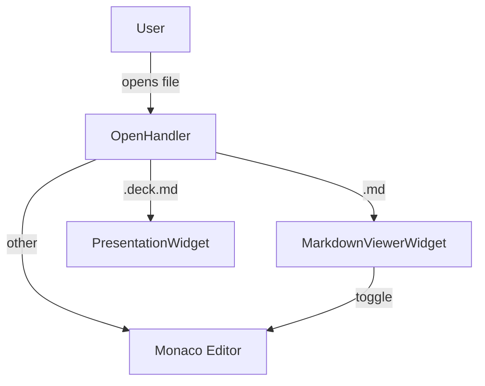
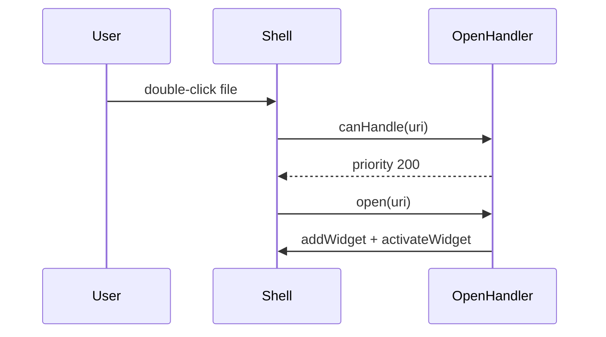

# E2E Test Project

This is a demo project for testing purposes.

## Getting Started

```bash
npm install
npm test
```

## Architecture


```mermaid
graph TD
    A[User] -->|opens file| B[OpenHandler]
    B -->|.md| C[MarkdownViewerWidget]
    B -->|.deck.md| D[PresentationWidget]
    B -->|other| E[Monaco Editor]
    C -->|toggle| E
```

## Sequence


```mermaid
sequenceDiagram
    participant U as User
    participant S as Shell
    participant H as OpenHandler
    U->>S: double-click file
    S->>H: canHandle(uri)
    H-->>S: priority 200
    S->>H: open(uri)
    H->>S: addWidget + activateWidget
```
